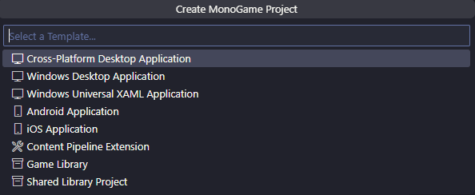
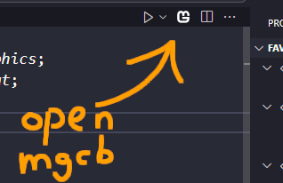

# MonoGame for VS Code

**MonoGame for VS Code** streamlines the experience of using [MonoGame](https://github.com/MonoGame/MonoGame) in Visual Studio Code. It ports key features of the Visual Studio 2022 MonoGame extension to VSC, including:

- Automatically install MonoGame templates
- Create new projects from the file menu or command palette
- Open the MGCB editor with the click of a button

## Requirements

 - [.NET SDK](https://dotnet.microsoft.com/en-us/download)
 - [C# Dev Kit](https://marketplace.visualstudio.com/items?itemName=ms-dotnettools.csdevkit)

## Quick Start
To create your first MonoGame project in VS Code:

1. Install the [.NET SDK](https://dotnet.microsoft.com/en-us/download) and [C# Dev Kit](https://marketplace.visualstudio.com/items?itemName=ms-dotnettools.csdevkit). Restart VS Code, then install this extension.
2. Go to *File > New File... > MonoGame: New Project*.

3. Choose a project template (if you aren't sure, choose *Cross-Platform Desktop Application*).
4. Enter project name and directory.

You're good to go! Your new project will be created at the directory. The solution explorer (a feature from the C# Dev Kit) should appear in the sidebar, allowing you to build, run and debug your game:

To open the MGCB editor, click the MonoGame button in the editor title bar or search for *MonoGame: Open MGCB Editor* in the command palette.

Templates are installed automatically the first time the extension is activated, but if you need to reinstall, you may use the *MonoGame: Install* command.

## License
[MIT](LICENSE.md) © reflector88